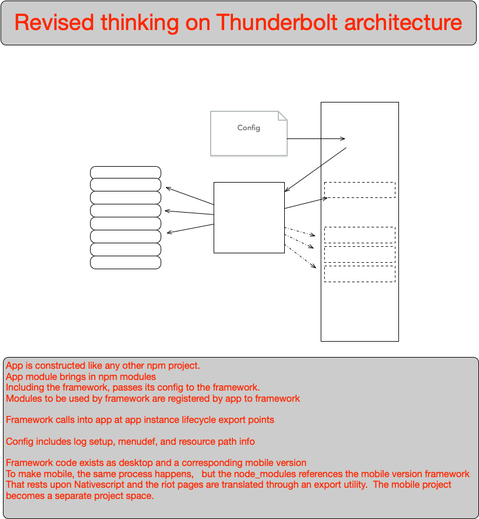

# thunderbolt-framework
Revised approach for creating the thunderbolt framework project

Continuing to work on this, but revising the way in which one uses
the Thunderbolt framwork and invokes it.

Thunderbolt-1 holds the old 'experimental' product. This is the new version.
[Read the notes](.aJournal/The%20inevitable%20refactor%20to%20do%20it%20more%20correctly.md)
